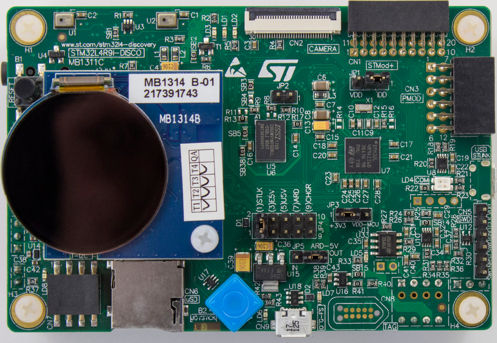

..
    Copyright 2019-2022 MicroEJ Corp. All rights reserved.
    Use of this source code is governed by a BSD-style license that can be found with this software.

.. |BOARD_NAME| replace:: STM32L4R9I-DISCO
.. |RCP| replace:: MICROEJ SDK
.. |PLATFORM| replace:: MicroEJ Platform
.. |SIM| replace:: MicroEJ Simulator
.. |CIDE| replace:: MICROEJ SDK
.. |RTOS| replace:: FreeRTOS RTOS
.. |MANUFACTURER| replace:: STMicroelectronics

.. _README MicroEJ BSP: ./STM32L4R9DISCO-bsp/projects/microej/README.rst
.. _RELEASE NOTES: ./RELEASE_NOTES.rst
.. _CHANGELOG: ./CHANGELOG.rst

==========================================
|PLATFORM| for |MANUFACTURER| |BOARD_NAME|
==========================================

This project is used to build a |PLATFORM| for the |BOARD_NAME|
development board.

Related Files
=============

This directory also contains:

* `CHANGELOG`_ to track the changes in the |BOARD_NAME| Platform
* `RELEASE NOTES`_ to list:

  - the supported hardware,
  - the known issues and the limitations,
  - the development environment,
  - the list of the dependencies and their versions.

* `README MicroEJ BSP`_ recommended for users familiar with the
  |MANUFACTURER| SDK and advanced usage on how to customize the build
  process.

Board Technical Specifications
==============================

.. list-table::

   * - Name
     - |BOARD_NAME|
   * - MCU part number
     - STM32L4R9AII6
   * - MCU architecture
     - Arm Cortex-M4
   * - MCU max clock frequency
     - 120 MHz
   * - Internal flash size
     - 2 MB
   * - Internal RAM size
     - 640 KB
   * - External flash size
     - 512 MB
   * - External RAM size
     - 16 MB
   * - Power supply
     - ST-LINK USB  V\ :sub:`BUS`\  or external sources

Here is a list of |BOARD_NAME| useful documentation links:

- Board documentation available `here <https://www.st.com/en/evaluation-tools/32l4r9idiscovery.html#documentation>`__
- MCU documentation available `here <https://www.st.com/en/microcontrollers-microprocessors/stm32l4r9-s9.html#documentation>`__

Platform Specifications
=======================

The Architecture version is ``7.16.0``.

This Platform provides the following Foundation Libraries:

.. list-table::
   :header-rows: 1

   * - Foundation Library
     - Version
   * - BON
     - 1.4
   * - DEVICE
     - 1.1
   * - DRAWING
     - 1.0
   * - ECOM
     - 1.1
   * - EDC
     - 1.3
   * - KF
     - 1.5
   * - MICROUI
     - 3.1
   * - NLS
     - 2.0
   * - SNI
     - 1.4
   * - SP
     - 2.0
   * - TRACE
     - 1.1

The |PLATFORM| is derived into:

- a Mono-Sandbox Platform (default)

The |PLATFORM| can be built using the following toolchains:

- IAR EmbeddedWorkbench version 9.20.2 or higher

Requirements
============

- PC with Windows 10
- Internet connection to `MicroEJ Central Repository <https://developer.microej.com/central-repository/>`_
- |RCP| Dist. ``20.12`` or higher, available `here <https://developer.microej.com/get-started/>`_
- |BOARD_NAME| board

BSP Setup
=========

Install the following software:

- The IAR EmbeddedWorkbench version 9.20.2, available `here <https://www.iar.com/iar-embedded-workbench/>`__
- The STM32CubeProgrammer version 2.8.0, available `here <https://www.st.com/en/development-tools/stm32cubeprog.html>`__

BSP Compilation
---------------

The Platform provides a pre-compiled Mono-Sandbox Application.
Validate the BSP installation by compiling the BSP to build a |BOARD_NAME|
Firmware.

To build the ``STM32L4R9DISCO-bsp`` project, open a
terminal and enter the following command lines:

**On Windows:**

.. code-block:: sh

      $ cd "xxx/STM32L4R9DISCO-bsp/projects/microej/EWARM/scripts"
      $ build.bat 

The BSP project build is launched. Please wait for the end of the build.

The build script expects the toolchain to be installed at a known
path.  If you installed it elsewhere, see `README MicroEJ BSP`_ for
how to customize its path.

Board Setup
===========

Please refer to the |MANUFACTURER| documentation for more details.

Power Supply
------------

The board can be powered by a mini-USB cable.

Programming
-----------

The |BOARD_NAME| board can be flashed using |MANUFACTURER|
bootloader. Please Follow the steps below:

- Plug the device to your computer using a USB cable (on micro-USB port labeled ``USB STLINK``).
- Open a terminal and enter the following command lines:

**On Windows:**

.. code-block:: sh

      $ cd "xxx/STM32L4R9DISCO-bsp/projects/microej/EWARM/scripts"
      $ run.bat 

The firmware is launched.

Logs Output
-----------

This |PLATFORM| uses the virtual UART from the |BOARD_NAME|
USB port.  A COM port is automatically mounted when the board is
plugged to a computer using USB cable.  All board logs are available
through this COM port.

The COM port uses the following parameters:

.. list-table::
   :widths: 3 2

   * - Baudrate
     - 115200
   * - Data bits bits
     - 8
   * - Parity bits
     - None
   * - Stop bits
     - 1
   * - Flow control
     - None

If flashed, the pre-compiled application outputs ``Hello World!`` on
the UART.

When running a Testsuite, logs must be redirected to a secondary UART
port.  Please refer to `Testsuite Configuration`_ for a detailed
explanation.

Platform Setup
==============

Platform Import
---------------

Import the projects in |RCP| Workspace:

- ``File`` > ``Import`` > ``Existing Projects into Workspace`` >
  ``Next``
- Point ``Select root directory`` to where the project was cloned.
- Click ``Finish``

Inside |RCP|, the selected example is imported as several projects
prefixed by the given name:

- ``STM32L4R9DISCO-configuration``: Contains the
  platform configuration description. Some modules are described in a
  specific sub-folder / with some optional configuration files
  (``.properties`` and / or ``.xml``).

- ``STM32L4R9DISCO-bsp``: Contains a ready-to-use BSP
  software project for the |BOARD_NAME| board, including a
  |CIDE| project, an implementation of MicroEJ core engine (and
  extensions) port on |RTOS| and the |BOARD_NAME| board
  support package.

- ``STM32L4R9DISCO-fp``: Contains the board description
  and images for the |SIM|. This project is updated once the platform
  is built.

- ``STM32L4R9DISCO-Platform-CM4hardfp_IAR83-1.0.4``:
  Contains the |RCP| Platform project which is empty by default until
  the Platform is built.

By default, the Platform is configured as a Mono-Sandbox Evaluation
Platform.

Platform Build
--------------

To build the Platform, please follow the steps below:

- Right-click on ``STM32L4R9DISCO-configuration``
  project in your |RCP| workspace.
- Click on ``Build Module``

The build starts.  This step may take several minutes.  The first
time, the Platform build requires to download modules that are
available on the MicroEJ Central Repository.  You can see the progress
of the build steps in the |RCP| console.

Please wait for the final message:

.. code-block::

                          BUILD SUCCESSFUL

At the end of the execution the |PLATFORM| is fully built for the
|BOARD_NAME| board and is ready to be used.

The Platform project should be refreshed with no error in the |RCP|
``STM32L4R9DISCO-Platform-CM4hardfp_IAR83-1.0.4``.

Please refer to
https://docs.microej.com/en/latest/ApplicationDeveloperGuide/standaloneApplication.html
for more information on how to build a MicroEJ Standalone Application.

An evaluation license is needed for building an application. Please refer to
https://docs.microej.com/en/latest/overview/licenses.html#evaluation-license
for information on how to acquire and activate a license.

Testsuite Configuration
=======================

To run a Testsuite on the |BOARD_NAME| board please refer to the testsuite tutorial `here <https://docs.microej.com/en/latest/Tutorials/tutorialRunATestSuiteOnDevice.html>`__.

In ``config.properties``, the property ``target.platform.dir`` must be
set to the absolute path to the platform.  For example
``xxx/STM32L4R9DISCO-Platform-CM4hardfp_IAR83-1.0.4/source``.

Troubleshooting
===============

Files not found during the build
--------------------------------

Errors about files not found during the build may be caused by long path.
